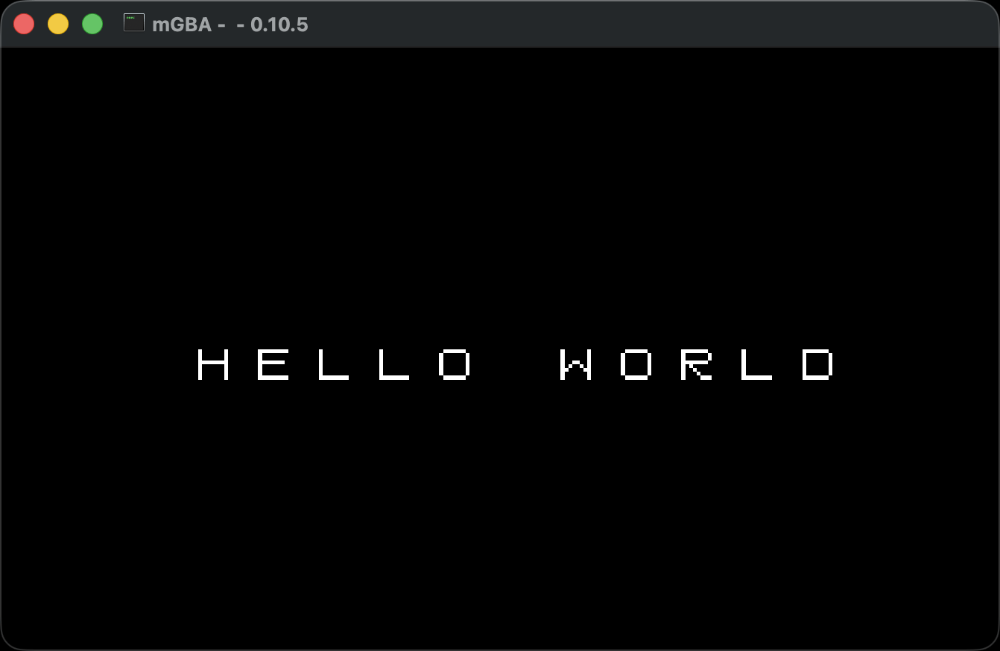
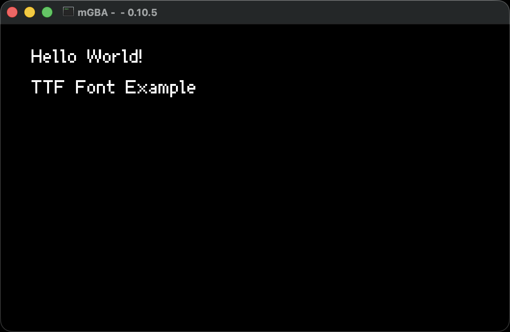
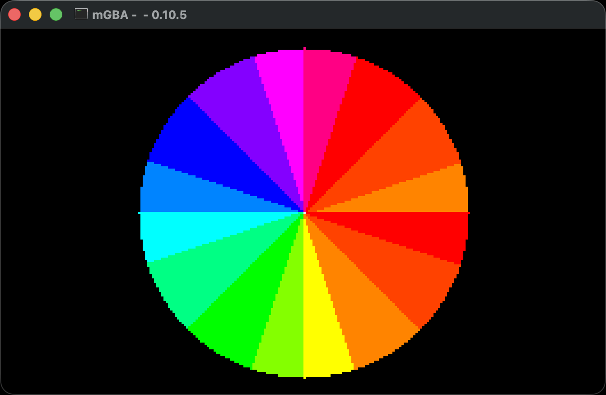
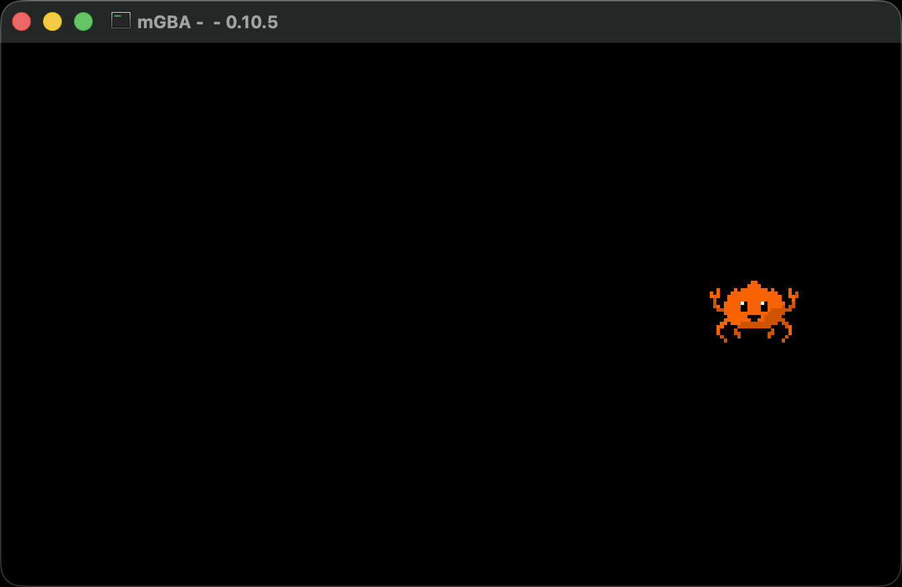
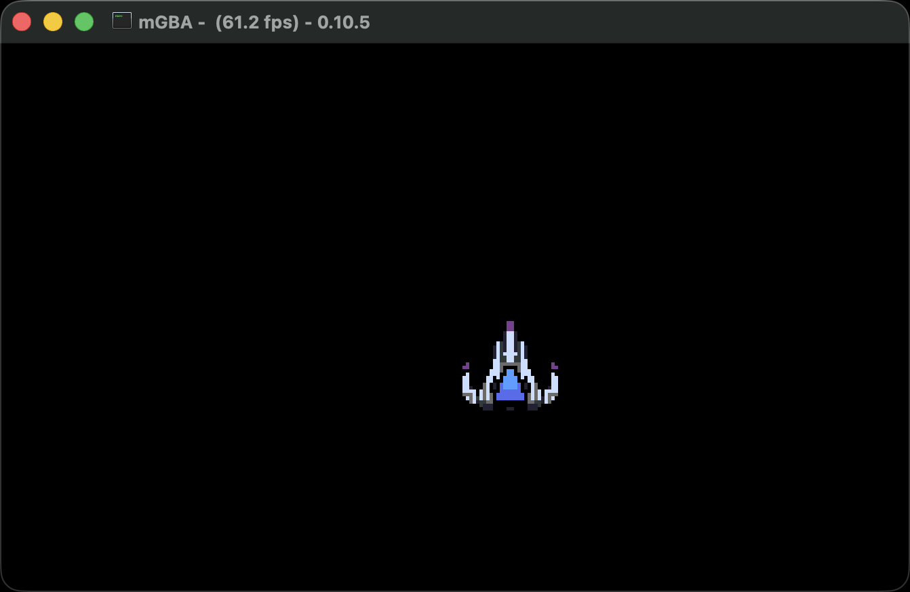
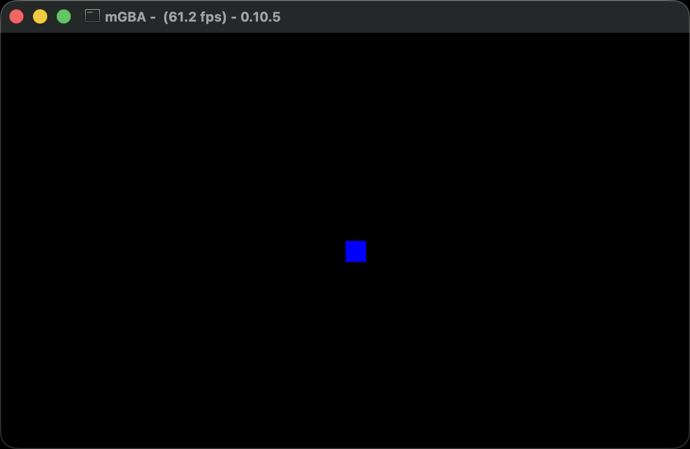
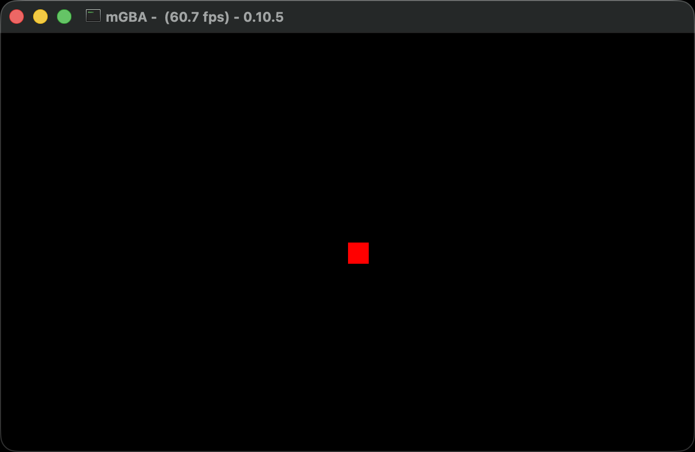

# agbrs-playground

Examples of Game Boy Advance game development with Rust using [agbrs](https://agbrs.dev).

## Examples

### Blocking agb Examples

- `hello_world` - Text rendering
  - 
- `hello_world_ttf` - Text rendering with TTF font
  - 
- `color_test` - Color Wheel with slices of a few RGB colors
  - 
- `color_spin` - Spin the Color Wheel continuously
  - 
- `simple_sprite` - Basic sprite display using aseprite
  - 

### Async Examples (embassy-agb)

- `moving_sprite_hold` - Async sprite movement with button holding support
  - 
- `moving_square` - Async sprite movement with button press detection
  - 
- `moving_square_hold` - Async sprite movement with button holding support
  - 

> [!NOTE]
> These async examples accompany [agb PR #1089](https://github.com/agbrs/agb/pull/1089) which adds async support to agb. I brought in Embassy as the async executor and implemented async for inputs, display, and time drivers.

## Quick Start

```sh
# Install prerequisites
cargo install agb-gbafix

# Run a blocking example (requires mgba-qt in PATH)
cargo run --bin hello_world

# Run an async example (requires mgba-qt in PATH)
cargo run --bin moving_square
cargo run --bin moving_square_hold

# Build for real hardware
cargo build --release --bin hello_world
agb-gbafix target/thumbv4t-none-eabi/release/hello_world -o hello_world.gba
```

## Resources

- [agb documentation](https://docs.rs/agb/latest/agb/)
- [agbrs book](https://agbrs.dev/book/)
- [mGBA emulator](https://mgba.io)
- ⭐️ [zpg6/agbrs-capture](https://github.com/zpg6/agbrs-capture) - For capturing GIFs of projects and examples

## License

[MIT](./LICENSE)

## Contributing

Contributions are welcome! Whether it's bug fixes, feature additions, or documentation improvements, we appreciate your help in making this project better. For major changes or new features, please open an issue first to discuss what you would like to change.
