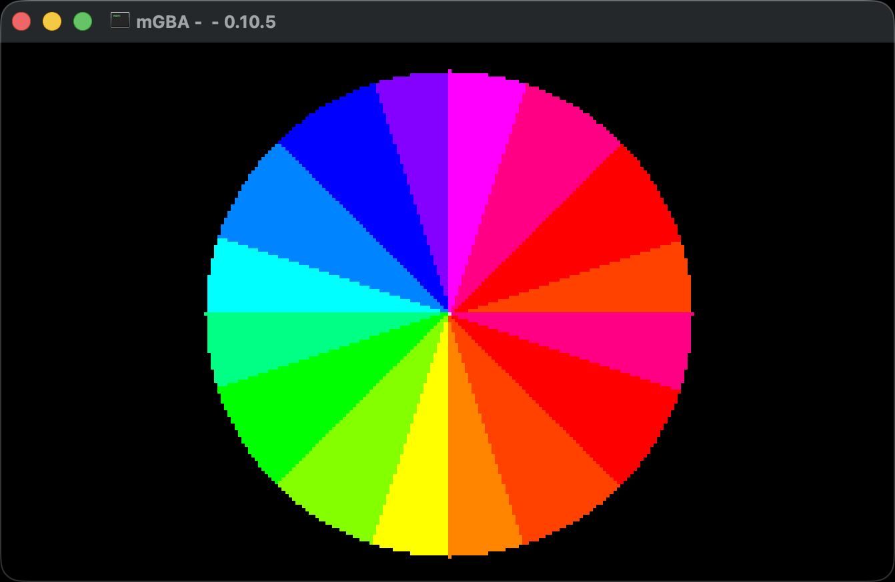

# agbrs-playground

Examples of Game Boy Advance game development with Rust using [agbrs](https://agbrs.dev).

## Examples

- `hello_world` - Text rendering
  - 
- `simple_sprite` - Basic sprite display
  - 
- `color_test` - Color Wheel with slices of a few RGB colors
  - 
- `color_spin` - Spin the Color Wheel continuously
  - 

## Quick Start

```sh
# Install prerequisites
cargo install agb-gbafix

# Run an example (requires mgba-qt in PATH)
cargo run --bin hello_world

# Build for real hardware
cargo build --release --bin hello_world
agb-gbafix target/thumbv4t-none-eabi/release/hello_world -o hello_world.gba
```

## Resources

- [agb documentation](https://docs.rs/agb/latest/agb/)
- [agbrs book](https://agbrs.dev/book/)
- [mGBA emulator](https://mgba.io)

## License

[MIT](./LICENSE)

## Contributing

Contributions are welcome! Whether it's bug fixes, feature additions, or documentation improvements, we appreciate your help in making this project better. For major changes or new features, please open an issue first to discuss what you would like to change.
